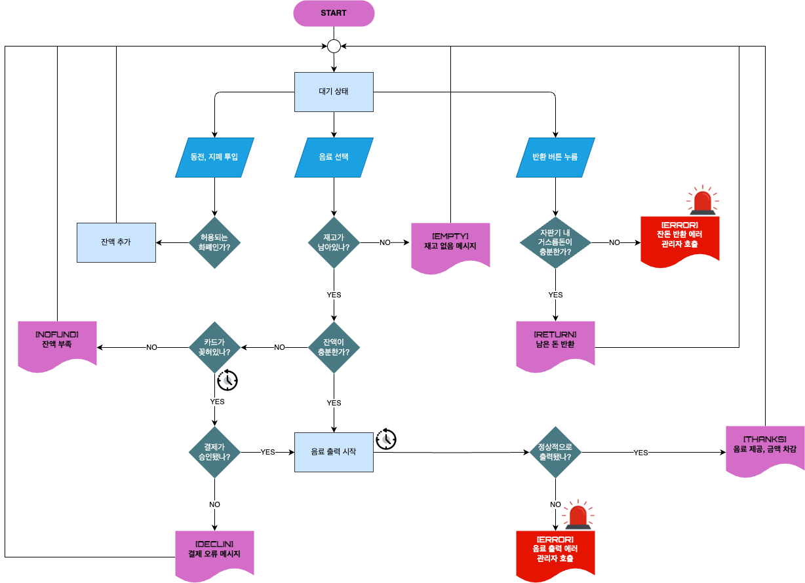
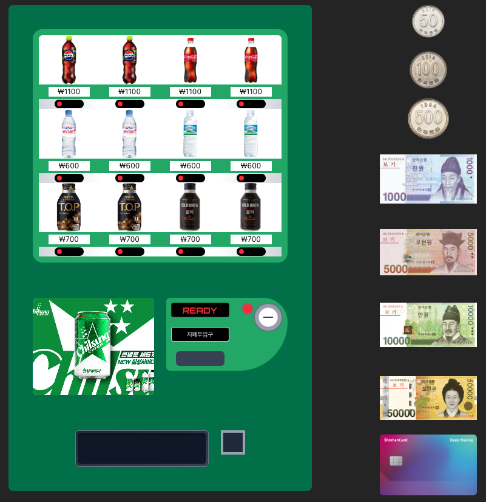

# Gyeongseon Vending Machine

## 도식화



## 프로젝트 구조

```
src/
├── assets/                  # 이미지 (화폐, 음료, 카드)
├── components/             # UI 컴포넌트
│   ├── drink/              # 음료 슬롯
│   ├── display/            # 전광판
│   ├── money/              # 투입구, 반환구
│   ├── payment/            # 카드 슬롯
│   └── return/             # 거스름돈 애니메이션
├── data/
│   ├── drinks.json         # 음료 정보
│   ├── vending.json        # 슬롯별 음료 배치
│   └── currencies.ts       # 화폐 정보 (금액, 종류, 이미지)
├── store/                  # zustand 상태 관리
├── utils/                  # 계산 함수 등 유틸
├── styles/                 # Tailwind + 커스텀 애니메이션
└── App.tsx                 # 메인 앱
```

## 실행 방법

1. **의존성 설치**

```bash
pnpm install
```

2. **개발 서버 실행**

```bash
pnpm dev
```

## 기술 스택

- **프론트엔드 프레임워크**: React
- **번들러**: Vite
- **패키지 매니저**: pnpm
- **언어**: TypeScript
- **스타일링**: Tailwindcss
- **전역 상태 관리**: Zustand

## 주요 기능



### 화폐 투입

- `50, 100, 500, 1000, 5000, 10000`원권 지원
- `currencies.ts`로 통일된 화폐 정의
- 우측 화폐 클릭으로 투입 가능

### 카드 결제

- 카드 선택 → 슬롯에 애니메이션 삽입
- 카드가 삽입되면 잔액 무관하게 결제 가능
- 카드 슬롯에 회전 + 깊이감 애니메이션 구현

### 음료 제공

- 음료 클릭 시: 재고 확인
- 금액 or 카드 확인
- 재고/잔액 차감
- 애니메이션으로 음료 낙하

### 전광판 메시지

- 상태에 따라 실시간 메시지 출력
- 폰트: `Orbitron`

### 거스름돈 반환

- `calculateChange()`로 최적 거스름돈 계산
- `useChangeReturn()`에 반환 큐 등록
- `ReturningCoin, ReturningBill에서` 순차 애니메이션
- 모든 반환 완료 후 상태 복구 (READY)

## 상태 관리 훅

- `useBalance` → 현재 투입 금액
- `useCashbox` → 자판기 내 화폐 보유량
- `useVending` → 슬롯/재고 관리
- `useDrinks` → 음료 정보 참조
- `useStatus` → 자판기 상태 + 메시지
- `useCard` → 카드 삽입 상태
- `useChangeReturn` → 반환 큐 관리
- `useDispense` → 음료 낙하 표시
